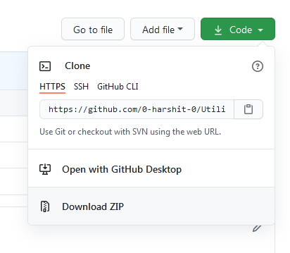

<h1>Utility-HTML5Canvas</h1>

<h2>
	Installation
</h2>

	Just download the file or clone it. 
	  
	Include the utility.js file in your html file. 
		<code><script type="application/js" src="utility.js" defer></code>  
	If you want seperate files, navigate to assets folder and include it in your html file. 
		<code>
			<script type="application/js" src="assets/shapes.js" defer> 
		</code>
	 
		<code>
			<script type="application/js" src="assets/vector.js" defer>
		</code>
	 
		<code>
			<script type="application/js" src="assets/stack.js" defer>
		</code>

<h2>
	Usage
</h2>
<ul>
	<li><h3>Stack.js</h3></li>
	

		You can use this library to create a Stack Data Structure.  
		For Detailed Guide refer <a href='https://github.com/0-harshit-0/Utility-HTML5Canvas/wiki'>Wiki</a>.
	

	<li><h3>Vector.js</h3></li>
	

		You can use this library to create a 2D vector object and perform various Vector related function.  
		For Detailed Guide refer <a href='https://github.com/0-harshit-0/Utility-HTML5Canvas/wiki'>Wiki</a>.
	

	<li><h3>shapes.js</h3></li>
	

		This library can be used to draw basic shapes provided in context interface as well as complex shapes like pentagon, hexagon, etc. which are not supported in canvas directly. It can also be used to set colour. 
		Other functions like: Line Width, Line cap, shadows, etc. need to be set on your own.  
		For Detailed Guide refer <a href=https://github.com/0-harshit-0/Utility-HTML5Canvas/wiki>Wiki</a>.
	

</ul>
